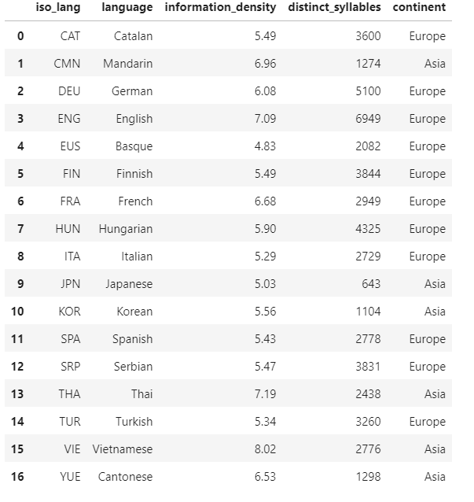
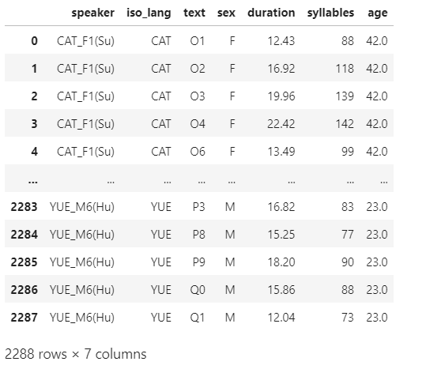
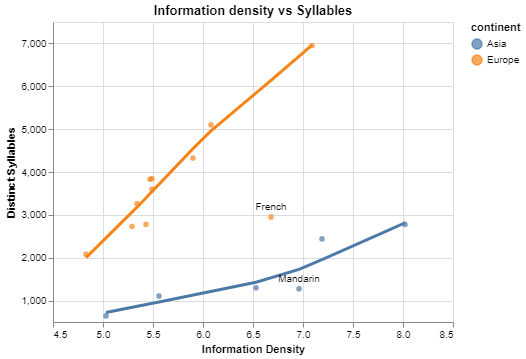
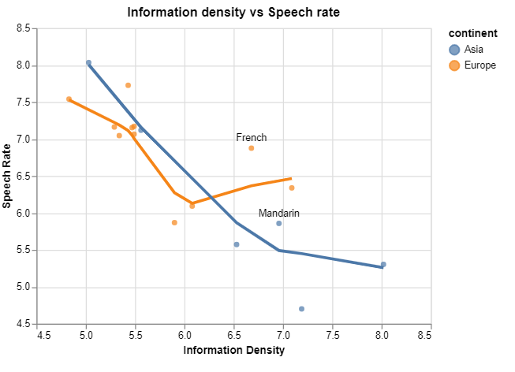
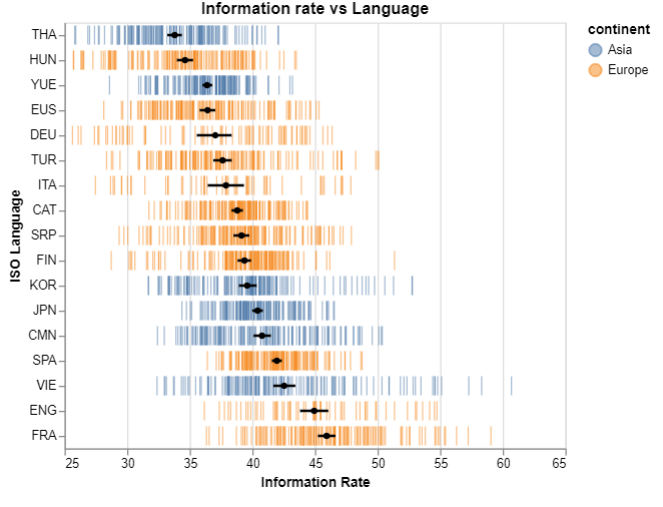

# Secret of Languages
This repo hosts a visual analysis of 17 different spoken languages in the world.

For more details, please refer to the [Kaggle Kernel](https://www.kaggle.com/arashshamseddini/secret-of-languages/).

In this analysis, I will visually demonstrate how these languages are different in certain attributes.

## Datasets
There are two data sets used in this study the `Languages` and the `Spoken texts` data sets (found [here](https://github.com/arashshams/Secret_of_Languages/blob/master/languages.csv) and [here](https://github.com/arashshams/Secret_of_Languages/blob/master/spoken-texts.csv)).

Below is a sneak peek at both data sets following with an overview of features in each.

<h3>Languages dataset</h4>

| Column              | Description                                       |
|---------------------|---------------------------------------------------|
| iso_lang            | ISO_639-3 language code                           |
| language            | Language name                                     |
| information density | Bits of information per syllable in the language  |
| distinct_syllables  | The number of different syllables in the language |
| continent           | The continent where the language is spoken        |

<h3>Spoken texts dataset</h4>

| Column    | Description                                     |
|-----------|-------------------------------------------------|
| speaker   | Speaker ID                                      |
| iso_lang  | ISO_639-3 language code                         |
| text      | Text ID                                         |
| sex       | The sex of the speaker                          |
| duration  | The number of seconds it took to speak the text |
| syllables | Number of syllables uttered during the speech   |
| age       | The age of the speaker                          |

The following plot shows how the trend that explains the relation between `information_density` and `distinct_syllables` divides the whole bunch into two clusters. It is worth-mentioning that **French** and **Mandarin** are outliers in each cluster.

Once `speech_rate` defined as `distinct_syllables`/`duration` is plotted against `information_density`, a subtle point is found. 

Technically, a high value in both features (`information_density` & `speech_rate`) would indicate a high information rate and efficient communication (a higher number of information bits conveyed per second).

It looks like we do not have a language that is high both in `information_density` and `speech_rate`, which could indicate that human minds are not good at processing auditory information beyond a certain rate limit.

Let's take another step deeper and define `information_rate` as `information_density` ✕ `speech_rate`. This new feature holds the amount of information per second conveyed by each speaker.

Now let's plot `information_rate` for each language in the study to see if there are at least small differences between them.

## Conclusions
- In an aim to investigate the potential differences and similarities of languages, 17 different languages from two continents (Asia and Europe) were studied. In the first step, I decided to evaluate the relatioshship between the `information_density` (bits of information per syllable) and the number of distinct syllabus for each language. Results proved that firstly as expeted the higher the `number of distinct syllabus`, the greater the `information_density` is. Secondly, the data for Asian languages cluster close to each other. Same story goes with European languages. Of course some outliers like **French** and **Mandarin** were also observed.

- In the second step, I studied the relationship between `information_density` (bits of information per syllable) and `speech_rate` (syllables per second, which is technically equal to number of syllables per duration) for the languages. Given the fact that a high value in both `information_density` and `speech_rate` would indicate a high information rate and efficient communication (a higher number of information bits conveyed per second), the reciprocal nature of these two variables confirmed the fact that we do not have a language that is high both in `information_density` and `speech_rate`, proving that human minds are not good at processing auditory information beyond a certain rate limit.

- In the final step, I decided to plot the rate at which information is conveyed (`information_rate`) for all the languages to see if there are at least small differences between them. Results show that the difference between the languages are not that significant. **Thai** is standing at one extreme with the lowest `information_rate` whereas **French** is on the other extreme with the highest `information_rate` among all languages. Leaving us with the very important conclusion that if you don't know **French** yet, you 'd better find a good teacher as soon as possible.
